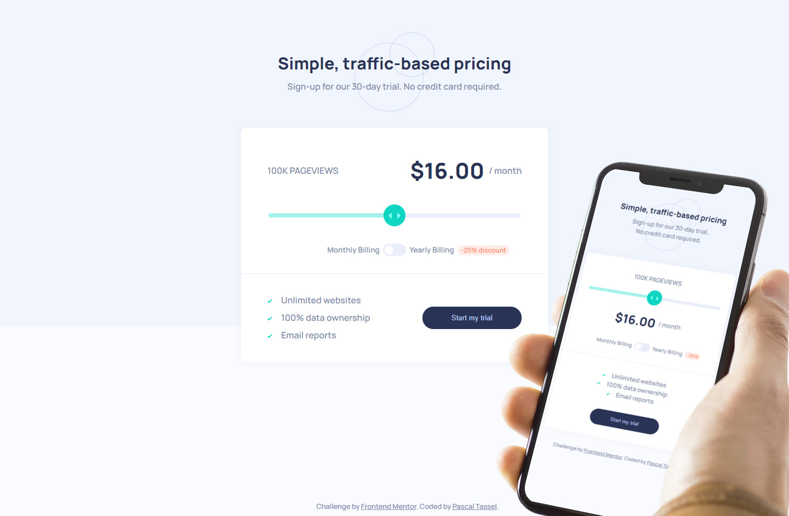

# Frontend Mentor - Interactive pricing component solution

This is a solution to the [Interactive pricing component challenge on Frontend Mentor](https://www.frontendmentor.io/challenges/interactive-pricing-component-t0m8PIyY8). Frontend Mentor challenges help you improve your coding skills by building realistic projects. 

## Table of contents

- [Overview](#overview)
  - [The challenge](#the-challenge)
  - [Screenshot](#screenshot)
  - [Link](#links)
- [My process](#my-process)
  - [Built with](#built-with)
  - [Useful resources](#useful-resources)
- [Author](#author)

## Overview

### The challenge

Users should be able to:

- View the optimal layout for the app depending on their device's screen size
- See hover states for all interactive elements on the page
- Use the slider and toggle to see prices for different page view numbers

### Screenshot

### Link
- Live Site URL: [https://pascaltassel.github.io/Interactive-pricing-component-challenge-hub/](https://pascaltassel.github.io/Interactive-pricing-component-challenge-hub/)

## My process

### Built with

- Semantic HTML5 markup
- Webpack
- SCSS
- Flexbox
- Mobile-first workflow

### Useful resources

- [mockupbro.com](https://mockupbro.com/) - This helped me for the iPhione X mockup.

## Author

- Website - [Add your name here](https://www.your-site.com)
- Frontend Mentor - [@yourusername](https://www.frontendmentor.io/profile/yourusername)
- Twitter - [@paTassel](https://www.twitter.com/patassel)